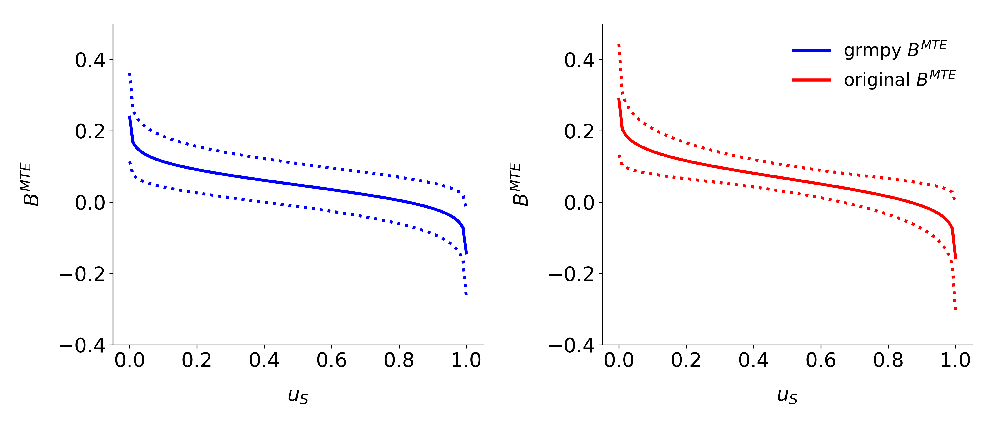

Reliability & Robustness
========================

The following section illustrates the reliability of the estimation strategy behind the ``grmpy`` package when facing agent heterogeneity and shows also that the corresponding results withstand a critical examination. The checks in both subsections are based on a mock `data set <https://www.aeaweb.org/aer/data/oct2011/20061111_data.zip>`_ respectively the `estimation results <https://assets.aeaweb.org/assets/production/articles-attachments/aer/data/oct2011/20061111_app.pdf#page=9>`_ from

    Carneiro, Pedro, James J. Heckman, and Edward J. Vytlacil. `Estimating Marginal Returns to Education. <https://pubs.aeaweb.org/doi/pdfplus/10.1257/aer.101.6.2754>`_ *American Economic Review*, 101 (6):2754-81, 2011.

Reliability
***********

The estimation results and data from Carneiro 2011 build the basis of the reliability test setup. The data is extended by combining them with simulated unobservables that follow a distribution that is pre-specified in the following `initialization file <https://github.com/OpenSourceEconomics/grmpy/blob/develop/development/tests/reliability/reliability.grmpy.ini>`_. In the next step the potential outcomes and the choice of each individual are calculated by using the estimation results.

This process is iterated a certain amount of times. During each iteration the rate of correlation between the simulated unobservables increases. Translated in the Roy model framework this is equivalent to an increase in the correlation between the unobservable variable :math:`U_1` and :math:`V`, the unobservable that indicates the preference for selecting into treatment.
Additionally the specifications of the distributional characteristics are designed so that the expected value of each unobservable is equal to zero. This ensures that the true average effect of treatment (ATE) is fixed to a value close to 0.5 independent of the correlation structure.

For illustrating the reliability we estimate the ATE during each step with two different methods.
The first estimation uses a simple OLS approach.

.. figure:: ../docs/figures/fig_ols_average_effect_estimation.png
    :align: center

As can be seen from the figure, the OLS estimator underestimates the effect significantly. The stronger the correlation between the unobservable variables the more or less stronger the downwards bias.

.. figure:: ../docs/figures/fig_grmpy_average_effect_estimation.png
    :align: center

The second figure shows the estimated ATE from the ``grmpy`` estimation process. Conversely to the OLS results the estimate of the average effect is close to the true value even if the unobservables are almost perfectly correlated.

Robustness
**********

For checking the robustness of the package's estimation process we replicate the results for the marginal treatment effect from Carneiro 2011 (:cite:`Carneiro2011`). For this purpose we created a jupyter notebook that runs an estimation based on an `initialization file <https://github.com/OpenSourceEconomics/grmpy/tree/master/development/tests/robustness/replication.grmpy.ini>`_. The init file corresponds to the specifications of the authors. As shown in the figure below the results are really close to the original results. The deviation seems to be negligible because of the usage of mock data.

