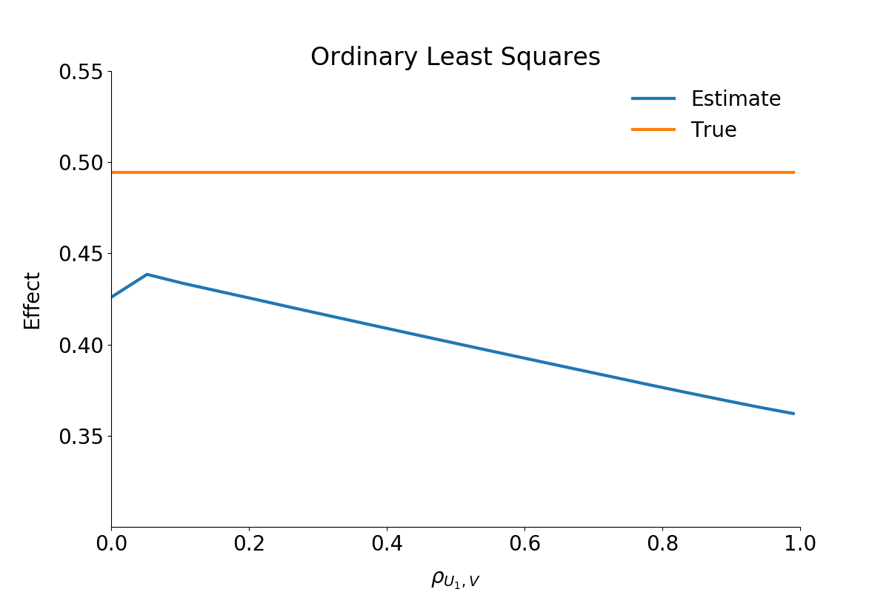
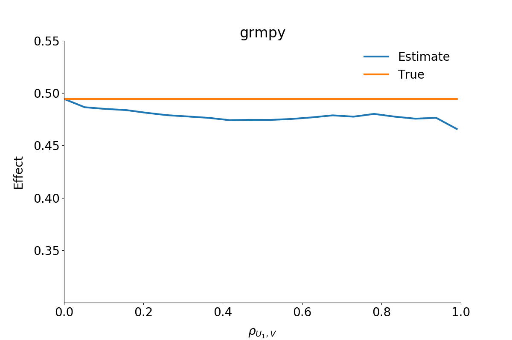
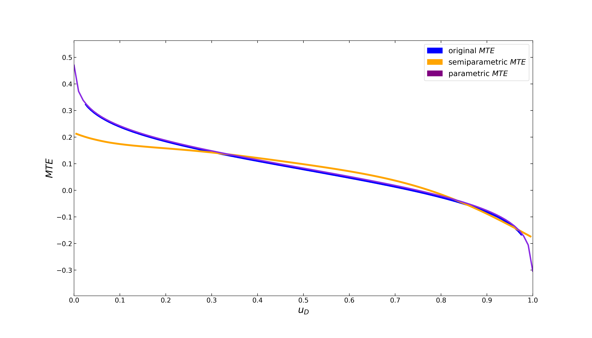
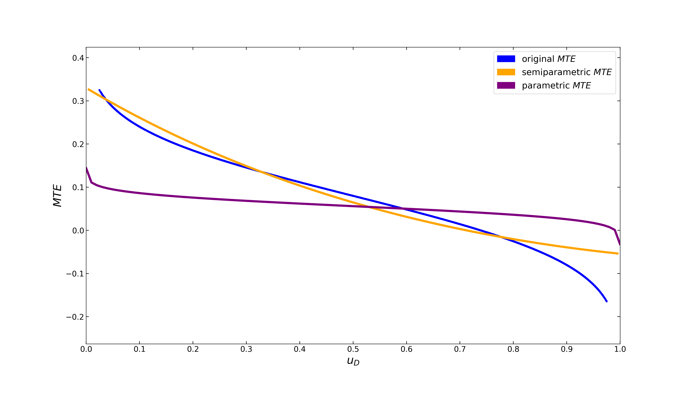
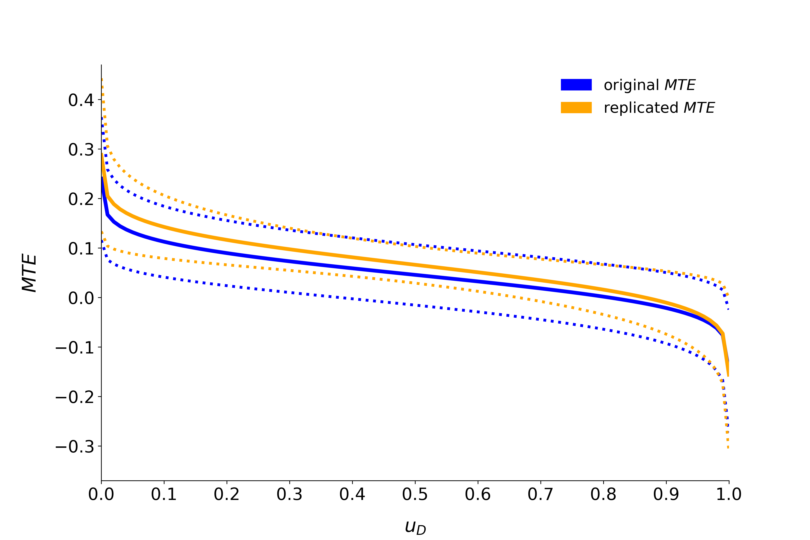
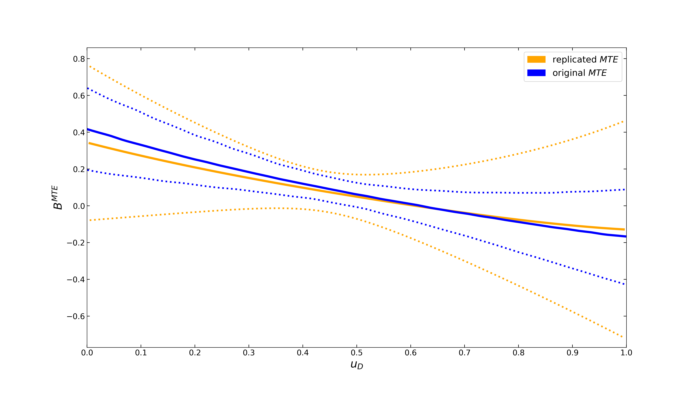

Reliability
===========

The following section illustrates the reliability of the estimation strategy behind the ``grmpy`` package when facing agent heterogeneity and shows also that the corresponding results withstand a critical examination. The checks in both subsections are based on a mock `data set <https://www.aeaweb.org/aer/data/oct2011/20061111_data.zip>`_ respectively the `estimation results <https://assets.aeaweb.org/assets/production/articles-attachments/aer/data/oct2011/20061111_app.pdf#page=9>`_ from

    Carneiro, Pedro, James J. Heckman, and Edward J. Vytlacil. `Estimating Marginal Returns to Education. <https://pubs.aeaweb.org/doi/pdfplus/10.1257/aer.101.6.2754>`_ *American Economic Review*, 101 (6):2754-81, 2011.

We conduct two different test setups. Firstly we show that ``grmpy`` is able to provide better results than simple estimation approaches in the presence of essential heterogeneity. For that purpose we rely on a monte carlo simulation setup which enables us to compare the results obtained by the ``grmpy`` estimation process with such of a standard Ordinary Least Squares (OLS) approach. Secondly we show that ``grmpy`` is capable of replicating the :math:`B^{MTE}` results by :cite:`Carneiro2011` for the parametric version of the Roy model.

Reliability of Estimation Results
---------------------------------

The estimation results and data from :cite:`Carneiro2011` build the basis of the reliability test setup. The data is extended by combining them with simulated unobservables that follow a distribution that is pre-specified in the following `initialization file <https://github.com/OpenSourceEconomics/grmpy/blob/master/promotion/04_grmpy_tutorial_notebook/files/reliability.grmpy.yml>`__. In the next step the potential outcomes and the choice of each individual are calculated by using the estimation results.

This process is iterated a certain amount of times. During each iteration the rate of correlation between the simulated unobservables increases. Translated in the Roy model framework this is equivalent to an increase in the correlation between the unobservable variable :math:`U_1` and :math:`V`, the unobservable that indicates the preference for selecting into treatment.
Additionally the specifications of the distributional characteristics are designed so that the expected value of each unobservable is equal to zero. This ensures that the true :math:`B^{ATE}` is fixed to a value close to 0.5 independent of the correlation structure.

For illustrating the reliability we estimate :math:`B^{ATE}` during each step with two different methods.
The first estimation uses a simple OLS approach.

As can be seen from the figure, the OLS estimator underestimates the effect significantly. The stronger the correlation between the unobservable variables the more or less stronger the downwards bias.

The second figure shows the estimated :math:`B^{ATE}` from the ``grmpy`` estimation process. Conversely to the OLS results the estimate of the average effect is close to the true value even if the unobservables are almost perfectly correlated.

Sensitivity to Different Distributions of the Unobservables
-----------------------------------------------------------
The parametric specification makes the strong assumption that the unobservables follow a joint normal distribution.
The semiparametric method of local instrumental variables is more flexible, as it does not invoke conditions on the functional form.
We test how sensitive the two methods to different distributions of the unobservables.
To that end, we use a toy model of the returns to college, where the shape of the true marginal treatment effect is known.

Normal Distribution
^^^^^^^^^^^^^^^^^^^

Both specifications come very close to the original curve. The parametric model even gets a perfect fit.

*beta* Distribution
^^^^^^^^^^^^^^^^^^^

The shape of the *beta* distribution can be flexibly adjusted by the tuning parameters :math:`\alpha` and :math:`\beta`,
which we set to 4 and 8, respectively.

The parametric model underestimates the returns to college, whereas the semiparametric MTE still fits the original
curve pretty well. The latter makes no assumption on the functional form of the unobservables and, thus, is more flexible
in estimating the parameter of interest when the assumption of joint normality is violated.
Which model is superior depends on the context. In empirical applications, we recommend to examine both.

Reliability
-----------

In another check of reliability, we compare the results of our estimation process with already existing results from the literature.
For this purpose we replicate the results for both the parametric and semiparametric marginal treatment effect from Carneiro 2011 (:cite:`Carneiro2011`).
Note that we make use of a mock data set, as the original data cannot be fully recreated from the
`replication material <https://www.aeaweb.org/articles?id=10.1257/aer.101.6.2754>`_.
Additionally we provide a
`jupyter notebook <https://github.com/OpenSourceEconomics/grmpy/blob/develop_segsell/tutorial.semipar.ipynb>`_
that runs an estimation based on an
`initialization file <https://github.com/OpenSourceEconomics/grmpy/blob/develop_segsell/replication_semipar.yml>`__
for easy reconstruction of our test setup. The init file corresponds to the specifications of the authors.

Parametric Replication
^^^^^^^^^^^^^^^^^^^^^^

As shown in the figure below, the parametric MTE is really close to the original results.
The deviation seems to be negligible because of the usage of a mock dataset.

Semiparametric Replication
^^^^^^^^^^^^^^^^^^^^^^^^^^

The semiparametric MTE also gets very close to the original curve. However, the 90 percent confidence bands
(250 bootstrap replications) are wider. As opposed to the parametric model, where the standard error bands are computed
analytically, confidence bands in the semiparametric setup are obtained via the bootstrap method,
which is sensitive to the discrepancies in the mock data set.
